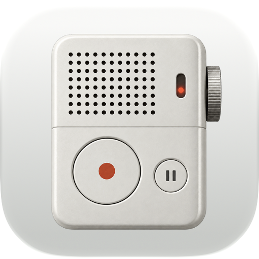

<p align="center">
  
</p>

<h1 align="center">Minutes</h1>

<p align="center">
  A native macOS app for recording meetings and transcribing them locally.
</p>

## Build

Requires macOS 15 or later, Apple Silicon, and full Xcode with Swift 6 and Icon Composer.

```sh
bash scripts/swift-local.sh test
bash scripts/build-app.sh release
open dist/Minutes.app
```

## Use

1. Select your browser and click **Start Recording**, or import existing audio.
2. Click **Stop & Transcribe** to create a transcript with speaker labels.
3. Click any word to listen, name speakers, and export Markdown.

Models download automatically on first use. Recordings and transcription stay on your Mac.

Settings include saved speakers, calendar meeting reminders, an export folder, and automatic model unloading.
